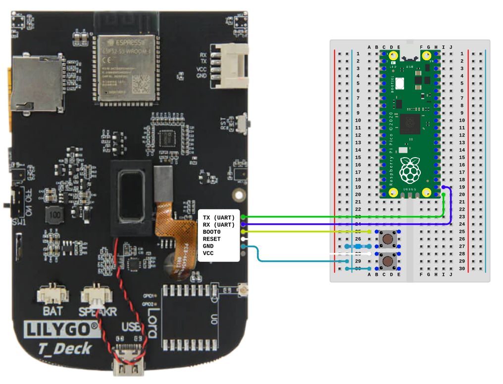

# LILYGO T-Deck Keyboard Firmware
Firmware for the LILYGO T-Deck Keyboard running on an ESP32-C3.

## Features
- **Keypress Buffer** - Key presses are stored for the host to retrieve.
- **I2C Commands** - Capable of receiving commands from the host.

## Hotkeys
| Action           | Hotkey  |
| ---------------- | ------- |
| Toggle Backlight | Alt + B |
| Clear Screen*    | Alt + L |


\* Requires OS support

## Flashing

Flashing requires a **USB-to-TTL adapter** or a **Raspberry Pi Pico** with [Pico UART Bridge](https://github.com/Noltari/pico-uart-bridge) software installed.

The pins being connected to are slightly undersized from a standard debug header. The preferred method of connecting is using probes/test clips. However, male headers removed from the housing will work too, just ensure they don't touch each other. The LILYGO T-Deck includes a 6-pin header that can be soldered to the board, but that may be unnecessarily risky.

It is also necessary to short the boot and reset pins to ground in order to get the keyboard ready for flashing. Build a breadboard like so, taking care for the way the buttons are oriented.



### Troubleshooting

Pico UART users may have to lower the baudrate to `76800` to get a successful flash. Set the following option in the `platformio.ini` file.

```
[env:t-deck-keyboard]
upload_speed = 76800
```